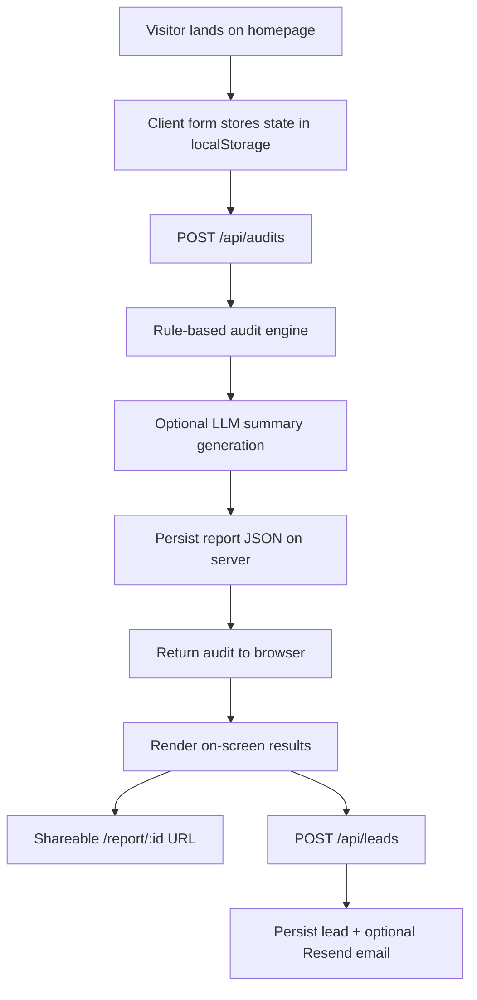

# Architecture

## Data flow

The user fills out the homepage form with team size, use case, and paid AI tools. That payload is posted to `/api/audits`, where the audit engine compares the current setup against rule-based plan-fit heuristics, same-vendor downgrade paths, cross-vendor alternatives, and credit-discount opportunities. The resulting report is then enriched with an AI-written summary when an API key is available, persisted server-side, and returned to the browser for immediate rendering. The same report id powers the public `/report/[id]` page, which deliberately excludes email and other identifying lead fields.

## Why this stack

I chose Next.js with TypeScript because the assignment mixes marketing site requirements with product requirements: shareable routes, API handlers, metadata generation, and public/private report states. TypeScript helps keep the audit payload, report objects, and API responses consistent across client and server boundaries. I stayed close to platform primitives instead of pulling in a heavy UI kit so the UX stays lightweight and easy to reason about.

## If this handled 10k audits per day

The first change would be replacing local JSON storage with Supabase Postgres or a managed Postgres instance, then moving rate limiting to Upstash Redis or a database-backed counter. I would cache static pricing catalogs, queue summary generation asynchronously, and log analytics plus failures into a dedicated observability pipeline. At higher volume I would also split report generation from lead capture so summary generation or email delays can never block the core audit path.

